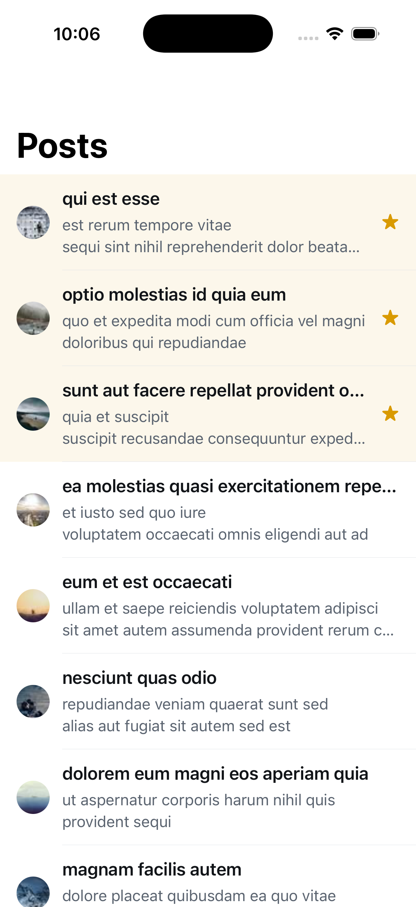
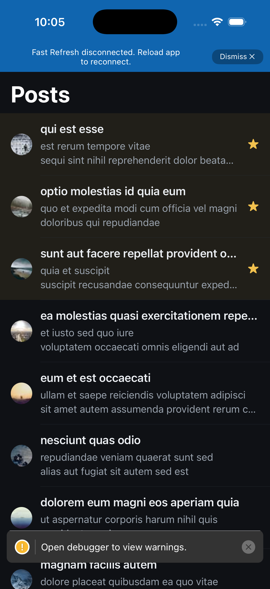
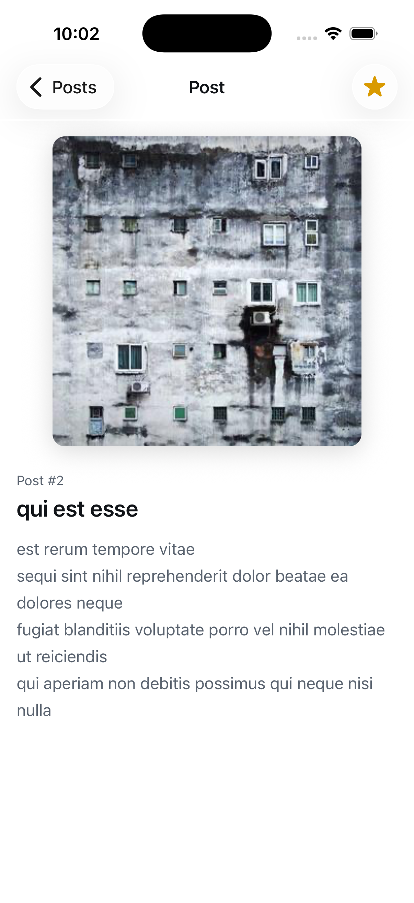
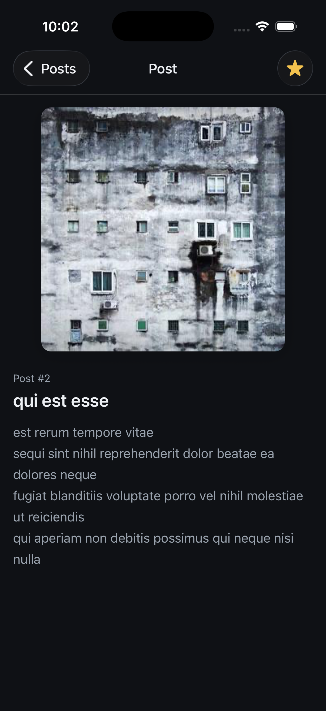
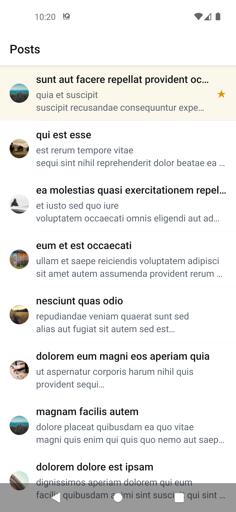
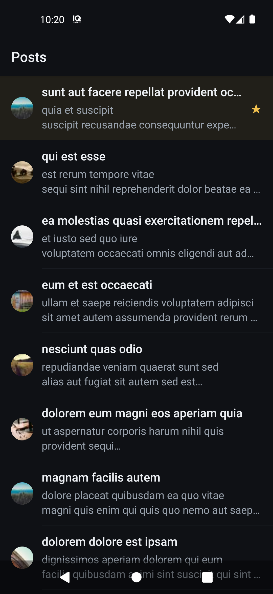
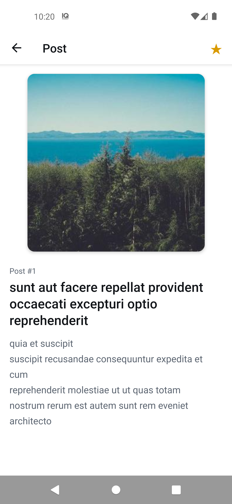
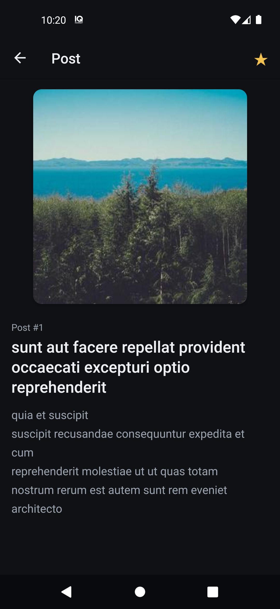

# lorem-feed

Мобильное приложение на React Native для iOS и Android: список постов, экран поста и избранное, которое поднимается наверх списка. Данные загружаются один раз и сохраняются между запусками.

|  | Светлая тема | Тёмная тема |
|--|--------------|-------------|
| iOS, список |  |  |
| iOS, пост |  |  |
| Android, список |  |  |
| Android, пост |  |  |

## Быстрый старт

### Окружение
Предполагается, что окружение React Native уже настроено по официальному гайду: [Set Up Your Environment](https://reactnative.dev/docs/set-up-your-environment).

- Node `^22.13.0 || ^24.3.0` (в `.nvmrc` — 24.14.0).
- Yarn: подойдёт любой, в том числе глобальный Yarn 1. Yarn 4.18.1 лежит в репозитории (`.yarn/releases`, `yarnPath` в `.yarnrc.yml`), и `yarn` передаёт ему управление. Corepack (`corepack enable`) не обязателен: если он включён, версия берётся из поля `packageManager`, та же самая.
- iOS (только macOS): Xcode, Ruby и Bundler. CocoaPods ставится через Bundler, версия зафиксирована в `Gemfile`.
- Android: Android SDK и JDK по гайду, запущенный эмулятор или подключённое устройство.

### Установка — одна команда
```sh
yarn install
```
На macOS `postinstall` сам выполняет `bundle install` и `bundle exec pod install`.

### Запуск — вторая команда
```sh
yarn ios       # или
yarn android
```

### Проверки
```sh
yarn typecheck     # tsc --noEmit
yarn lint          # ESLint, включая правила FSD и инвариантов
yarn format:check  # Prettier
yarn test          # Jest
```
Те же проверки запускает CI на GitHub Actions.

## Готовый APK
- Скачать: [app-release.apk](https://github.com/beliykirill/lorem-feed/releases/download/v1.0.0/app-release.apk)
- Страница релиза: [v1.0.0](https://github.com/beliykirill/lorem-feed/releases/tag/v1.0.0)

Сборка подписана debug-ключом шаблона React Native и предназначена для проверки, не для публикации. При установке может понадобиться разрешить установку из неизвестных источников.

## Стек и архитектура
- React Native 0.87.1 (bare React Native CLI, New Architecture), React 19.2.3, TypeScript 6.0.3.
- React Navigation 7 (native-stack).
- Zustand 5 с `persist` поверх `react-native-mmkv` 4: два стора, по одному на сущность (посты и избранное).
- `@faker-js/faker` — seed для картинок picsum.
- Jest, ESLint (`eslint-plugin-boundaries` для правил FSD), Prettier. Версии зафиксированы точно, без диапазонов.

Архитектура — Feature-Sliced Design: `app → pages → widgets → features → entities → shared`, слой импортирует только нижние слои, чужой слайс — только через его `index.ts`. Правило проверяет lint. Навигация рендерится только после того, как все сторы прочитаны из MMKV (gate гидрации), поэтому решение «загружать или нет» принимается по сохранённым данным.

Подробно — в [`docs/architecture.md`](docs/architecture.md): слои и слайсы, модели, сторы, потоки данных, ADR, проверки инвариантов. Требования и принятые решения — в [`docs/requirements.md`](docs/requirements.md).

## Допущения и сознательные решения
- **Детали поста.** Задание требует брать пост из `/posts/{id}` и запрашивать данные только один раз. DetailsScreen сразу рендерит те же поля из данных списка вместе с картинкой 300×300, без спиннера, потому что `/posts/{id}` возвращает идентичные `title` и `body`, и параллельно запрашивает `/posts/{id}`, если деталей ещё нет в кэше. После первого успешного ответа детали и URL картинки 300×300 сохраняются в стор (`detailsById`) навсегда, и экран берёт данные оттуда, без новых запросов. Если `/posts/{id}` ни разу не прошёл, показываются данные списка, а запрос повторяется при следующем открытии; заранее все посты не загружаются.
- **Картинки.** У поста одна картинка: в списке она 32×32, в деталях та же самая в 300×300. Seed генерируется через `faker.string.alphanumeric` один раз при первой загрузке списка и хранится вместе с постом. Оба URL picsum строятся из него (`https://picsum.photos/seed/{seed}/{w}/{h}`). `faker.image.url` даёт URL того же формата `picsum.photos/seed/…`, но с новым seed на каждый вызов, поэтому faker генерирует seed один раз, а URL строится из него. Так изображение не меняется ни между экранами, ни между запусками. Картинки случайные для каждой установки. Без сети картинки, которые ещё не попали в системный кэш, не загрузятся, вместо них показывается fallback.
- **Однократная загрузка.** Если первая загрузка упала, её можно повторить кнопкой на экране ошибки. Пустой ответ API не считается успешной загрузкой: показывается «No posts» с кнопкой повтора. Невалидный ответ считается ошибкой. Один раз загружается непустой валидный список.
- **Pull-to-refresh нет.** Список запрашивается только один раз и никогда не обновляется, поэтому обновлять нечего. Запрет закреплён lint-правилом.
- **Избранное переключается только на экране поста.** В списке переключателя сознательно нет: задание описывает его только для DetailsScreen, а при нажатии в списке строка сразу уезжала бы наверх, из-под пальца, потому что избранные посты стоят первыми.
- **Порядок избранного.** Избранные посты идут первыми, недавно добавленные выше. Остальные — в порядке ответа API; пост, убранный из избранного, возвращается на своё место.
- **FlatList, а не FlashList.** Список — 100 простых строк, строки мемоизированы. На таком объёме FlashList выигрыша не даст, а новая нативная зависимость не оправдана. Если список вырастет, FlashList — первый кандидат на замену.
- **Сброс данных.** Кнопки сброса в приложении нет. Чтобы увидеть первую загрузку заново, переустановите приложение или очистите его данные (Android: Settings → Apps → lorem-feed → Storage → Clear data; iOS: удалить и установить заново).
- **Повреждённые данные.** Если сохранённые данные повреждены и не читаются, они сбрасываются, причём по отдельности: повреждён список — он загрузится заново, повреждено избранное — оно очистится.
- **Дизайн.** Рисунков 1 и 2 в задании нет, дизайн произвольный. Светлая и тёмная тема — по системной настройке.

## Инварианты и их проверка
| Инвариант | Чем проверен |
|-----------|--------------|
| `/posts` запрашивается только до первого успеха (непустой валидный список) | юнит-тесты `load-posts.test.ts`, `validate.test.ts` |
| Seed картинки генерируется один раз при обогащении, оба URL строятся из него, faker не вызывается при рендере | юнит-тесты `enrich.test.ts`, `load-posts.test.ts`; lint: faker разрешён только в модуле обогащения; `eslint-plugin-boundaries` запрещает глубокий импорт в чужой слайс, поэтому обогащение доступно снаружи только через `savePostList` |
| `/posts/{id}` запрашивается только без кэша, ошибка ничего не сохраняет | юнит-тест `load-post-details.test.ts` |
| Решение о загрузке принимается только после гидрации всех сторов | структурно: экраны рендерятся только после gate; gate и восстановление после ошибки — юнит-тесты `hydration-gate.test.ts`, `create-hydration-tracker.test.ts` |
| Нет pull-to-refresh и кнопки сброса данных | lint: запрет `onRefresh` / `refreshControl` и `clearStorage` / `clearAll`; отсутствие action'а очистки проверяет ревьюер |

Полная таблица с пояснениями — [`docs/architecture.md`, раздел 6](docs/architecture.md#6-проверки-инвариантов).

## AI-подход
Решение сделано AI-only в Claude Code. Подход — **spec-driven development**:
- спецификация и архитектура написаны до первой строки кода: [`docs/requirements.md`](docs/requirements.md) (явные и неявные требования, неоднозначности, решения автора) и [`docs/architecture.md`](docs/architecture.md);
- у каждого инварианта есть проверка: юнит-тест, lint-правило или структурная гарантия с объяснением;
- сабагент-ревьюер (только чтение) сверяет код со спецификацией по пунктам и сообщает о расхождениях с `file:line`;
- работа шла по этапам, после каждого агент останавливался до подтверждения автора.

Процесс, инструменты и разбор ошибок агента — [`docs/ai/AI_WORKFLOW.md`](docs/ai/AI_WORKFLOW.md). Экспорт сессий, промпты, журнал и скриншоты — [`docs/ai/`](docs/ai/README.md). Правила агента — [`CLAUDE.md`](CLAUDE.md) и [`.claude/`](.claude/).
