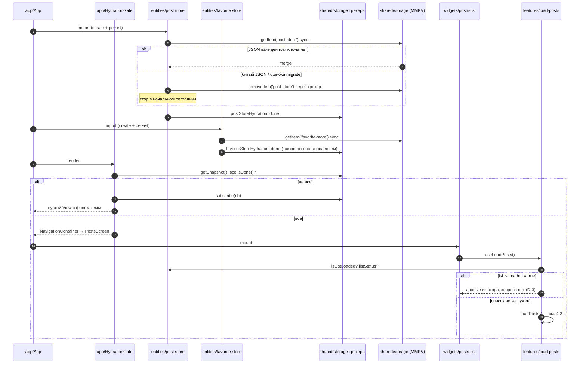
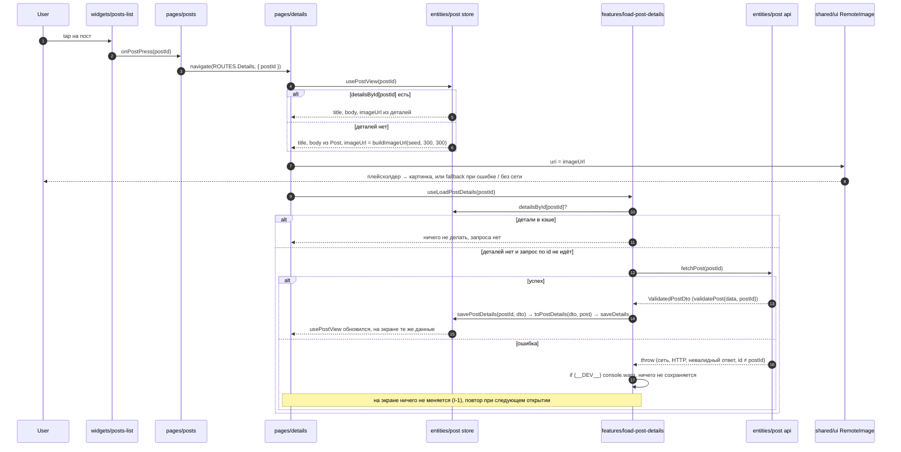

# Архитектура: lorem-feed

Документ описывает, как требования из [`requirements.md`](requirements.md) раскладываются по модулям. Новых решений здесь нет: решения автора сначала записаны в `requirements.md`, вопросы без ответа вынесены в раздел 8. Идентификаторы T/F/D/I/R/Q — из `requirements.md`.

## 1. FSD-структура

### 1.1 Слои и правило импортов
Слои сверху вниз: `app → pages → widgets → features → entities → shared` (R-10).

- Слой импортирует только из слоёв ниже.
- Между слайсами импорт идёт только через public API слайса (`index.ts`), без глубоких импортов.
- Внутри слайса импорты относительные.
- Правило разрешает импорт между слайсами одного слоя через `index.ts`, но в этом плане таких импортов нет: связь `post` и `favorite` собирается в слое выше (сортировка, 1.3, R-10).
- Правило закреплено lint-плагином `eslint-plugin-boundaries` (6.2, ADR-2).

Сегменты внутри слайса: `ui` (компоненты), `model` (стор, селекторы, хуки, логика), `api` (запросы), `lib` (чистые функции), `config` (константы и типы). Слайс создаёт только те сегменты, которые ему нужны.

### 1.2 Дерево

```text
src/
├── app/
│   ├── App.tsx                 корневой компонент
│   ├── providers/              SafeAreaProvider, NavigationContainer с темой
│   ├── navigation/             RootStack по RootStackParamList из shared/config
│   └── hydration/
│       ├── model/              isGateOpen (чистая), createHydrationGate, hydrationGate, useStoresHydrated
│       └── ui/                 HydrationGate
├── pages/
│   ├── posts/                  PostsScreen
│   └── details/                DetailsScreen
├── widgets/
│   └── posts-list/
│       ├── ui/                 PostsList (FlatList), состояния loading / error / empty
│       └── model/              sortPosts (чистая функция), useSortedPosts
├── features/
│   ├── load-posts/
│   │   └── model/              loadPosts, useLoadPosts
│   ├── load-post-details/
│   │   └── model/              loadPostDetails, useLoadPostDetails
│   └── toggle-favorite/
│       ├── ui/                 ToggleFavoriteButton (Animated scale)
│       └── model/              useToggleFavorite
├── entities/
│   ├── post/
│   │   ├── api/                fetchPosts, fetchPost
│   │   ├── api/types.ts        PostDto, ValidatedPostDto
│   │   ├── lib/                validatePosts, validatePost, mapPostDto, buildImageUrl, enrich.ts (enrichPosts, toPostDetails)
│   │   ├── model/              types, usePostStore, postStoreHydration, селекторы, usePostView, savePostList, savePostDetails
│   │   └── ui/                 PostCard
│   └── favorite/
│       └── model/              types, useFavoriteStore, favoriteStoreHydration, селекторы
└── shared/
    ├── api/                    http-клиент (fetchJson), базовый URL
    ├── config/navigation/      RootStackParamList, ROUTES
    ├── lib/storage/            экземпляр MMKV, адаптер StateStorage, createHydrationTracker
    ├── theme/                  светлая и тёмная палитры, useTheme
    └── ui/                     RemoteImage, StarIcon, Button, StateView
```

### 1.3 Слайсы и ответственность

| Слайс | Отвечает за | Public API (`index.ts`) | Импортирует |
|-------|-------------|-------------------------|-------------|
| `app` | провайдеры, навигация, тема по системной настройке (R-14), gate гидрации (R-9) | — | `pages/*`, `entities/post`, `entities/favorite` (только трекеры гидрации), `shared/config`, `shared/theme` |
| `pages/posts` | `PostsScreen`: рендерит `PostsList` и передаёт ему `onPostPress(id)`, который вызывает `navigate(ROUTES.Details, { postId })` (F-5). Навигацией управляют только страницы | `PostsScreen` | `widgets/posts-list`, `shared/config` |
| `pages/details` | `DetailsScreen`: берёт `postId` из параметров маршрута, собирает данные поста, кнопку избранного и фоновую загрузку деталей (R-10) | `DetailsScreen` | `entities/post`, `features/toggle-favorite`, `features/load-post-details`, `shared/config`, `shared/ui` |
| `widgets/posts-list` | `FlatList` с ключом `id` (I-7), без `refreshControl` (R-4); экраны loading / error / empty с Retry (I-1); сортировка (R-5, I-6). Получает `onPostPress(id)` пропсом, про навигацию не знает | `PostsList` | `features/load-posts`, `entities/post`, `entities/favorite`, `shared/ui` |
| `features/load-posts` | решение «загружать или нет», запрос, разбор пустого ответа, вызов `savePostList` (D-1, D-3, R-4) | `useLoadPosts` | `entities/post` |
| `features/load-post-details` | проверка кэша, однократный запрос `/posts/{id}`, вызов `savePostDetails` (R-3) | `useLoadPostDetails` | `entities/post` |
| `features/toggle-favorite` | кнопка-переключатель: текст, `StarIcon`, анимация (F-8, R-7, I-11) | `ToggleFavoriteButton` | `entities/favorite`, `shared/ui` |
| `entities/post` | DTO и доменные типы, api, валидация ответа, маппер DTO → модель, обогащение seed'ом, `buildImageUrl`, стор, операции «обогатить и сохранить», `PostCard` (`isFavorite` — пропс, звезда через `StarIcon`) | типы, `usePostStore`, `postStoreHydration`, селекторы, `usePostView`, `fetchPosts`, `fetchPost`, `savePostList`, `savePostDetails`, `PostCard`. `enrichPosts`, `toPostDetails`, `mapPostDto`, `buildImageUrl` и валидаторы — внутренние, наружу не экспортируются | `shared` |
| `entities/favorite` | стор избранного `Record<id, addedAt>` (R-5, D-4) | типы, `useFavoriteStore`, `favoriteStoreHydration`, селекторы | `shared` |
| `shared/api` | `fetchJson(url)`: GET, проверка `response.ok`, `JSON.parse`. Возвращает `unknown`, про сущности не знает (I-8) | `fetchJson`, `API_BASE_URL` | — |
| `shared/config/navigation` | `RootStackParamList` (`Posts: undefined`, `Details: { postId: number }`) и константы `ROUTES`. Лежит в `shared`, чтобы `app` и `pages` импортировали типы маршрутов вниз | `RootStackParamList`, `ROUTES` | — |
| `shared/lib/storage` | `createMMKV()`, адаптер `StateStorage` (`getItem → getString(key) ?? null`, `setItem → set`, `removeItem → remove`), `createHydrationTracker(storage, key)` (3.3). Трекер получает хранилище аргументом и к MMKV не привязан (I-8) | `mmkvStorage`, `createHydrationTracker` | — |
| `shared/theme` | палитры, `useTheme` на `useColorScheme` (R-14) | `useTheme`, токены | — |
| `shared/ui` | `RemoteImage` (плейсхолдер при загрузке, fallback при ошибке, R-14), `StarIcon` (R-6, R-7), `Button`, `StateView` (спиннер, текст, кнопка Retry) | компоненты | `shared/theme` |

**Почему сортировка в `widgets`, а не в `features`.** Сортировка объединяет две сущности (`post`, `favorite`) для отображения и не является действием пользователя. `features` в FSD — это действия (загрузить, переключить), а список с порядком и флагом `isFavorite` — часть виджета, который его показывает. В `entities` сортировку не кладём: тогда одна сущность зависела бы от другой.

**Почему `PostCard` получает `isFavorite` пропсом.** Тогда `entities/post` не зависит от `entities/favorite`, и связь двух сущностей остаётся в одном месте — в `widgets/posts-list`.

**Почему `enrichPosts` не в public API.** Снаружи слайса нельзя вызвать `enrichPosts` и faker напрямую, только через операцию «обогатить и сохранить». Глубокий импорт `entities/post/lib/...` запрещён lint-правилом (6.2), так что это структурная гарантия. Где вызывается сам `savePostList` (только в `features/load-posts` после успешного непустого ответа), lint не ограничивает: это договорённость, её проверяет ревьюер (6.3).

**`StarIcon`.** `Text` с символом ★ (U+2605) при `filled` или ☆ (U+2606), пропсы `filled`, `size`, `color`, цвет по умолчанию из темы. Именно эти символы, а не эмодзи ⭐: эмодзи не перекрашивается. Новых зависимостей нет (R-6, R-7).

## 2. Модели данных

```ts
// entities/post/api/types.ts — ответ API как есть
type PostDto = { userId: number; id: number; title: string; body: string };

// entities/post/model/types.ts — доменная модель, только используемые поля
type PostFields = { id: number; title: string; body: string };

type Post = PostFields & {
  seed: string;          // faker.string.alphanumeric, один раз при обогащении (R-2)
  thumbnailUrl: string;  // buildImageUrl(seed, 32, 32)
};

type PostDetails = PostFields & {
  imageUrl: string;      // buildImageUrl(post.seed, 300, 300), при первом успехе /posts/{id}
};

// entities/favorite/model/types.ts
type FavoritesMap = Record<number, number>; // postId → addedAt (epoch ms, Date.now())
```

| Поле | Где хранится | Откуда берётся | Когда меняется |
|------|--------------|----------------|----------------|
| `Post.id/title/body` | `post` стор, persist | `GET /posts` → `mapPostDto` | один раз, при первой успешной загрузке |
| `Post.seed` | `post` стор, persist | `faker.string.alphanumeric(SEED_LENGTH)` в `enrichPosts` (`lib/enrich.ts`) | один раз, при обогащении. Длина seed выбирается при реализации (R-2) |
| `Post.thumbnailUrl` | `post` стор, persist | `buildImageUrl(seed, 32, 32)` в `enrichPosts` | один раз |
| `PostDetails.*` | `post` стор, persist, `detailsById[id]` | `GET /posts/{id}` → `toPostDetails(dto, post)`: `mapPostDto` + `buildImageUrl(post.seed, 300, 300)` | один раз, при первом успешном ответе (R-3) |
| `addedAt` | `favorite` стор, persist | `Date.now()` при добавлении | при каждом добавлении; при удалении запись удаляется |

`Post` = используемые поля API (`id`, `title`, `body`) + данные обогащения (`seed`, `thumbnailUrl`) (R-4, R-2). `userId` есть только в `PostDto`: в UI он не используется, поэтому в стор и MMKV не попадает.

`buildImageUrl(seed, w, h)` → `https://picsum.photos/seed/{seed}/{w}/{h}`. Чистая функция: faker не вызывает, состояния не читает (R-2, инвариант 2).

**DTO → модель.** `userId` отбрасывается при валидации: валидатор возвращает **новый объект** только с проверенными полями (`ValidatedPostDto`). `Pick<>` сужает только тип, поэтому поля копируются явно. `mapPostDto(dto: ValidatedPostDto): PostFields` (`entities/post/lib`) переводит проверенный DTO в доменные поля. Через него проходят оба ответа (`lib/enrich.ts`): `enrichPosts(dtos)` = `mapPostDto` + seed + `thumbnailUrl`; `toPostDetails(dto, post)` = `mapPostDto` + `imageUrl` из `post.seed`.

**Обогатить и сохранить** (`entities/post/model`, public API):
- `savePostList(dtos)` → `saveList(enrichPosts(dtos))`;
- `savePostDetails(postId, dto)` → `saveDetails(postId, toPostDetails(dto, post))`, где `post` читается из текущего состояния стора (`usePostStore.getState()`) по `postId`. Ключ один и тот же — запрошенный `postId`: по нему `load-post-details` проверяет кэш, по нему же сохраняются детали. Защитное поведение (R-3): детали сохраняются только для поста, который есть в списке, иначе ничего не сохраняется, в dev — предупреждение. Сейчас путь недостижим (детали открываются только из списка), проверка держит целостность стора. Отдельного теста нет: сама проверка — обычная ветка в коде, а структурно гарантировано только то, что путь недостижим.

**Валидация.** `PostDto` — описание контракта API. Валидаторы возвращают тип только с проверенными полями: `ValidatedPostDto = Pick<PostDto, 'id' | 'title' | 'body'>`, и маппер `mapPostDto` принимает именно его (R-4).
- `validatePosts(unknown): ValidatedPostDto[]` бросает ошибку, если ответ не массив или у элемента нет числового `id` либо строковых `title`, `body`. `userId` не проверяется и в результат не копируется. Пустой массив валиден по форме, решение «пусто — не успех» принимает `load-posts`.
- `validatePost(unknown, expectedId): ValidatedPostDto` проверяет те же поля и `id === expectedId`. Несовпадение `id` с запрошенным `postId` — невалидный ответ: `fetchPost(postId)` бросает ошибку, ничего не сохраняется, повтор — при следующем открытии (R-3).

## 3. Сторы Zustand

Два независимых стора, у каждого свой `persist` поверх `mmkvStorage` и свой трекер гидрации (R-9).

### 3.1 `usePostStore` (`entities/post`)

| Поле | Тип | Persist |
|------|-----|---------|
| `posts` | `Post[]`, в порядке ответа API | да |
| `isListLoaded` | `boolean`, флаг «непустой валидный список сохранён» | да |
| `detailsById` | `Record<number, PostDetails>` | да |
| `listStatus` | `'idle' \| 'loading' \| 'error' \| 'empty'` | нет |

Action'ы: `setListStatus(status)`, `saveList(posts)` (атомарно записывает `posts` и `isListLoaded = true`, сбрасывает статус), `saveDetails(postId, details)` (ключ — запрошенный `postId`).
Селекторы: `selectPost(id)`, `selectDetails(id)` — возвращают ссылки из стора без копирования.
Хук `usePostView(id)` → `{ title, body, imageUrl }`: поля и `imageUrl` из `detailsById[id]`, если запись есть, иначе из `Post` и `buildImageUrl(post.seed, 300, 300)` (R-2, R-3). Хук подписывается на `selectPost(id)` и `selectDetails(id)` по отдельности, а объект собирает в `useMemo`. Селектор Zustand 5, который на каждый вызов возвращает новый объект, ломает `useSyncExternalStore` (бесконечный ре-рендер), поэтому составной результат собирается вне селектора. Альтернатива — `useShallow` из `zustand/react/shallow`, тот же пакет.

Persist: `name: 'post-store'`, `version: 1`, `partialize: ({ posts, isListLoaded, detailsById }) => ({ … })`, `onRehydrateStorage: postStoreHydration.onRehydrateStorage`, где `postStoreHydration = createHydrationTracker(mmkvStorage, 'post-store')`.

### 3.2 `useFavoriteStore` (`entities/favorite`)

| Поле | Тип | Persist |
|------|-----|---------|
| `favorites` | `Record<number, number>` (`postId → addedAt`) | да |

Action'ы: `toggle(postId)` — добавляет с `Date.now()` или удаляет. Селектор `selectIsFavorite(id)`.
Persist: `name: 'favorite-store'`, `version: 1`, `onRehydrateStorage: favoriteStoreHydration.onRehydrateStorage`, где `favoriteStoreHydration = createHydrationTracker(mmkvStorage, 'favorite-store')`. Транзиентных полей нет, но `partialize` всё равно оставляет только `favorites`, чтобы action'ы не попадали в JSON.

### 3.3 Гидрация и восстановление после ошибки
Поведение проверено на `zustand@5.0.15` 2026-10-07: прочитан исходник `esm/middleware.mjs` (`persistImpl`) и запущен скрипт со стором в памяти.

**Что делает zustand:**

| Случай | пост-колбэк `(state, error)` | `hasHydrated()` после `create` | Состояние стора |
|--------|-------------------------------------|--------------------------------|-----------------|
| валидный JSON | `error = undefined` | `true` | из хранилища |
| ключа нет | `error = undefined` | `true` | начальное |
| битый JSON | `error = SyntaxError` | **`false`** | начальное |
| `migrate` бросает | `error = Error` | **`false`** | начальное |

- Гидрация синхронная. `hydrate()` вызывается внутри создания стора, чтение обёрнуто в `toThenable`. Если `getItem` вернул не `Promise`, вся цепочка `.then` выполняется синхронно, а MMKV `getString` синхронный. Цепочка станет асинхронной, только если `migrate` вернёт `Promise` или хранилище заменят на асинхронное.
- Сигнатура: `onRehydrateStorage` — **фабрика**. `persist` вызывает её до чтения хранилища, передавая текущее состояние, а возвращённую функцию `(state, error)` вызывает после гидрации: с `state` при успехе, с `error` при ошибке. Вся логика трекера — в возвращённой функции. Если бы сама фабрика ставила признак завершения, он вставал бы до чтения данных, а ветка ошибки не выполнялась бы никогда.
- Пост-колбэк вызывается **до того, как `create(...)` вернул стор**: переменная стора в этот момент ещё не присвоена. Значит, внутри колбэка нельзя обращаться к стору. Ключ удаляется через адаптер хранилища, а признак завершения хранится вне стора.
- При ошибке zustand не вызывает `set`, поэтому стор уже в начальном состоянии. Явный сброс через `setState` не нужен и был бы вреден: `persist` сразу записал бы начальное состояние обратно в только что удалённый ключ.
- При ошибке `hasHydrated()` остаётся `false` навсегда, поэтому gate на него не опирается.

**`createHydrationTracker(storage, storageKey)`** (`shared/lib/storage`). `storage` — любой `StateStorage`: в приложении `mmkvStorage`, в тесте мок. Возвращает:
- `onRehydrateStorage: () => (state, error) => { … }` — передаётся в опции `persist`. Фабрика ничего не делает. Пост-колбэк: если `error` есть — `storage.removeItem(storageKey)` и `if (__DEV__) console.warn(error)`; в обоих случаях ставит признак «гидрация завершена» и уведомляет подписчиков;
- `isDone()` — признак завершения: успех или восстановление;
- `subscribe(cb)` → `unsubscribe`.

Восстановление идёт по каждому стору отдельно. Повреждён `post-store` — `isListLoaded = false`, список загрузится заново, избранное не тронуто. Повреждён `favorite-store` — избранное очищается, список остаётся. Запись в MMKV работает и при `hasHydrated() = false`: `persist` пишет на каждый `set`.

**Gate** (`app/hydration`):
- `isGateOpen(trackers)` — чистая функция: все `isDone()`?
- `createHydrationGate(trackers)` — без React, возвращает `{ getSnapshot, subscribe }`: `getSnapshot = () => isGateOpen(trackers)`, `subscribe` подписывается на все трекеры. Трекер хранит признак, а не только событие, поэтому завершение до подписки не теряется.
- `hydrationGate = createHydrationGate([postStoreHydration, favoriteStoreHydration])` — **один объект на уровне модуля** с явным списком трекеров. Если создавать его внутри хука, `subscribe` будет новым на каждом рендере, и `useSyncExternalStore` станет переподписываться.
- `useStoresHydrated()` — тонкая обёртка без аргументов: `useSyncExternalStore(hydrationGate.subscribe, hydrationGate.getSnapshot)`.
- `HydrationGate`: пока `false` — пустой `View` с фоном темы, без спиннера (с синхронным MMKV ожидание мгновенное, его закрывает нативный сплэш); когда `true` — навигация.

## 4. Потоки данных

### 4.1 Запуск и гидрация



Избранное видно сразу при старте (D-4): оба стора гидрированы до первого рендера навигации. Гидрацию гарантирует только gate: любые экраны и хуки загрузки существуют лишь внутри навигатора, а он рендерится после gate (инвариант 4).

### 4.2 Первая загрузка списка
`loadPosts(deps)` в `features/load-posts/model`. Зависимости передаются аргументом (`getState`, `fetchPosts`, `savePostList`), чтобы тестировать без сети и MMKV. Проверки гидрации нет: её гарантирует gate (4.1).

1. Если `isListLoaded` — выход (инвариант 1).
2. Если `listStatus === 'loading'` — выход: повторный вызов во время запроса не создаёт второй запрос.
3. `setListStatus('loading')` → `fetchPosts()` (`fetchJson` + `validatePosts`).
4. Исключение (сеть, HTTP, невалидный ответ) → `setListStatus('error')`, ничего не сохраняется.
5. Пустой массив → `setListStatus('empty')`, ничего не сохраняется (R-4).
6. Иначе `savePostList(dtos)`: внутри `entities/post` `enrichPosts` (`mapPostDto` отбрасывает `userId`, добавляются seed и `thumbnailUrl`) → `saveList`. `posts` и `isListLoaded = true` записываются атомарно и попадают в MMKV.

`useLoadPosts()` вызывает `loadPosts` в `useEffect` на mount и возвращает `{ status, retry }`. `retry` вызывает `loadPosts` повторно.

### 4.3 Открытие деталей



- Загрузка и ошибка `/posts/{id}` на экране не отображаются (I-1). Свои состояния есть только у `RemoteImage` (R-14).
- `loadPostDetails(postId, deps)` в `features/load-post-details/model`, по образцу `loadPosts`: зависимости `getDetails`, `fetchPost`, `savePostDetails` и `inFlight` передаются аргументом.
- Защита от двойного запроса: `inFlight` — `Set` с id запросов, которые сейчас в полёте. Например, StrictMode в dev монтирует эффект дважды. Хук `useLoadPostDetails` использует один `Set` на уровне модуля, а тесты передают свежий `Set` в каждом случае, поэтому результат не зависит от порядка тестов. `Set` не персистится.
- Кнопка избранного работает независимо от запроса (R-8, I-12).
- Детали других постов заранее не грузятся (R-3, I-7).

### 4.4 Переключение избранного
1. `ToggleFavoriteButton({ postId })` читает `selectIsFavorite(postId)`: текст «Add to favorites» / «In favorites» и `StarIcon` с `filled` (R-7, I-11).
2. По нажатию — scale-анимация `Animated` и `toggle(postId)`: запись `postId → Date.now()` добавляется или удаляется, `persist` пишет в MMKV.
3. `widgets/posts-list` подписан на оба стора через `useSortedPosts`. После возврата список уже пересортирован (I-5): `sortPosts(posts, favorites)` ставит избранные первыми по `addedAt` по убыванию, остальные идут в исходном порядке API (R-5, I-6). PostsScreen остаётся смонтированным в native-stack, поэтому позиция скролла сохраняется (R-14).

`sortPosts` — чистая функция: `(Post[], FavoritesMap) → Array<Post & { isFavorite: boolean }>`. Исходный массив не мутирует. `useSortedPosts` мемоизирует результат по ссылкам `posts` и `favorites`.

### 4.5 Ошибка, пустой ответ и повтор
| Ситуация | `listStatus` | Что сохраняется | UI PostsScreen |
|----------|--------------|-----------------|----------------|
| Первый рендер до `useEffect` (`isListLoaded = false`) | `idle` | ничего | спиннер, как при `loading` |
| Идёт запрос | `loading` | ничего | спиннер |
| Сеть / HTTP / невалидный ответ | `error` | ничего | «Something went wrong» + Retry |
| Пустой массив | `empty` | ничего | «No posts» + Retry |
| Успех (`isListLoaded = true`) | `idle` | `posts`, `isListLoaded` | список |
| Повторный запуск после успеха | `idle` | — | список из MMKV, запроса нет |
| Повреждён `post-store` | `idle` | ключ удалён (3.3) | как при первом запуске, избранное сохранено |
| Повреждён `favorite-store` | — | ключ удалён (3.3) | список как обычно, избранное пустое |

Тексты экранов окончательно выбираются на этапе UI. Retry вызывает `loadPosts` повторно. `listStatus` не персистится, поэтому после перезапуска с незагруженным списком загрузка начнётся заново.

## 5. ADR

### ADR-1. Zustand + persist поверх MMKV
- **Контекст.** Нужен state-manager (T-5) и хранение между запусками (D-3, D-4). Данные загружаются один раз, кэш запросов с инвалидацией не нужен.
- **Решение.** Zustand 5 с middleware `persist`. Хранилище — `react-native-mmkv` v4 через адаптер `StateStorage`. Два стора, по одному на сущность, у каждого свой ключ, `version` и трекер гидрации (R-9).
- **Альтернативы.** Redux Toolkit + redux-persist: больше шаблонного кода, отдельная гидрация через `PersistGate`. AsyncStorage: асинхронный, гидрация после первого рендера, больше окно для гонки «запрос до гидрации». Один общий стор: одна гидрация, но стор знает обо всех сущностях и не ложится на FSD-слайсы.
- **Последствия.** Гидрация синхронная, но gate остаётся явным. `hasHydrated()` при ошибке гидрации навсегда `false`, поэтому нужен собственный трекер (3.3). MMKV — нативный модуль: в Jest нужен мок (`createMockMMKV`), сборку с RN 0.87.1 проверяем на этапе каркаса (R-9).

### ADR-2. Feature-Sliced Design
- **Контекст.** T-6 требует разделить UI, логику и состояние. Приложение маленькое, но проверяющий оценивает архитектуру.
- **Решение.** FSD с шестью слоями (R-10), public API через `index.ts`. Правило импортов проверяет `eslint-plugin-boundaries` (dev-зависимость, одобрена автором 2026-10-08): импорт только вниз по слоям, между слайсами — только через `index.ts`. Остальное (что куда положено) проверяет сабагент `reviewer`.
- **Альтернативы.** Плоская структура `screens/components/store/api`: проще, но границы держатся только на дисциплине. «Clean architecture» с use-case'ами и репозиториями: для двух экранов слишком много слоёв. Самописные шаблоны `no-restricted-imports` для FSD отклонены после двух серьёзных багов, найденных ревьюером. Первый: настройки правила в `overrides` заменяют друг друга, а не объединяются. Второй: относительный импорт из соседнего слайса (`../../post/lib/enrich`) не содержит имени слоя и шаблонами не ловится.
- **Последствия.** Новая dev-зависимость `eslint-plugin-boundaries`. Объединение `post` + `favorite` вынесено в виджет, типы маршрутов — в `shared/config`. Несколько слайсов почти пустые (`entities/favorite` — только стор): это осознанная цена явных границ.

### ADR-3. Одна картинка из общего seed
- **Контекст.** F-2 и F-7 требуют картинки 32×32 и 300×300, D-2 — генерацию один раз. Picsum без `/seed/` отдаёт случайную картинку на каждый запрос (I-4).
- **Решение.** Один seed на пост из `faker.string.alphanumeric` при обогащении списка, хранится с постом. Оба URL строятся из него чистой функцией `buildImageUrl`. URL 300 показывается сразу, после успеха `/posts/{id}` сохраняется в детали (R-2).
- **Альтернативы.** `faker.image.urlPicsumPhotos` дважды — две разные картинки у одного поста, пользователь решит, что открыл не тот пост. `faker.seed(id)` — картинки одинаковые на всех установках, противоречит R-4. Ждать `/posts/{id}` перед показом картинки 300 — без сети картинки не было бы вовсе.
- **Последствия.** Картинка одна и та же в списке и в деталях, между экранами и между запусками. Без сети показывается fallback, если картинки нет в системном кэше `Image`. Импорт faker разрешён lint-правилом только в модуле обогащения, а само обогащение доступно снаружи слайса только через `savePostList`. `@faker-js/faker` 10.6 — только ESM (`"type": "module"`, сборки CommonJS нет, проверено в npm 2026-10-07). Разрешение модуля в Jest проблем не даёт: в `exports` у пакета есть условие `default`, оно подходит и для CommonJS-окружения Jest. Не хватает только трансформации ESM-кода. На этапе каркаса: добавить `@faker-js` в исключения `transformIgnorePatterns` Jest, чтобы `enrich.test.ts` загрузился, и проверить, что faker собирается в Metro на обеих платформах.

### ADR-4. Yarn Berry
- **Контекст.** S-2: установка одной командой, воспроизводимо у проверяющего (I-10).
- **Решение.** Yarn 4 через Corepack, версия в `packageManager`, `nodeLinker: node-modules`, `pod install` в `postinstall` только на macOS (R-11).
- **Альтернативы.** npm: рабочий вариант, но выбран Yarn Berry (R-11). Yarn Classic: в режиме поддержки, новых версий нет. pnpm: изолированный `node_modules` на симлинках, для React Native обычно нужен `node-linker=hoisted`. Plug'n'Play: с React Native не работает (R-11).
- **Последствия.** Проверяющему нужен включённый Corepack (`corepack enable`), это будет в README. Флаги Yarn Classic (например, `-s`) не работают: см. журнал этапа 2.

### ADR-5. Без TanStack Query (и RTK Query)
- **Контекст.** Оба запроса однократные, данные хранятся вечно, рефетча, инвалидации и фоновых обновлений нет (D-1, R-3, R-4).
- **Решение.** Запросы в api-слое сущности, логика «один раз» в `features/load-*`, состояние и кэш в Zustand (R-9).
- **Альтернативы.** TanStack Query + persister: его модель stale/refetch пришлось бы отключать почти целиком (`staleTime: Infinity`, без refetch-on-focus и reconnect), а кэш хранился бы во втором месте рядом с Zustand. RTK Query: тянет Redux.
- **Последствия.** Дедупликацию запросов и статусы пишем сами (4.2, 4.3). Это несколько строк, и они покрыты тестами (раздел 6).

## 6. Проверки инвариантов

У каждого инварианта указан способ проверки: юнит-тест, lint-правило или структурная гарантия (R-13). Юнит-тесты — только логика, Jest, api замокан, без компонентных тестов и отдельных тестов api-слоя. Сабагент `reviewer` дополнительно проверяет всё. Основная гарантия — тесты и lint, кроме двух явно отмеченных мест, которые проверяет ревьюер (6.3): часть инварианта 5 (нет action'а очистки, `removeItem` только в трекере) и договорённость «`savePostList` вызывается только в `features/load-posts`» (инвариант 2).

### 6.1 Юнит-тесты

| Файл | Что проверяет |
|------|---------------|
| `widgets/posts-list/model/sortPosts.test.ts` | избранные сверху; между собой по `addedAt` по убыванию; неизбранные в исходном порядке; после удаления из избранного пост возвращается на исходное место; входной массив не мутирует |
| `features/load-posts/model/loadPosts.test.ts` | успех → `savePostList` вызван один раз, повторный вызов не запрашивает и не вызывает `savePostList` (обогащение не перезапускается); `fetchPosts` бросает (сеть, HTTP, невалидная структура — валидация внутри `fetchPosts`, сама она проверяется в `validate.test.ts`) → `error`, ничего не сохранено, флаг не стоит, повтор запрашивает; пустой массив → `empty`, флаг не стоит; повторный вызов во время `loading` не создаёт второй запрос |
| `entities/post/lib/validate.test.ts` | `validatePosts`: не массив → ошибка; элемент без числового `id` или без строковых `title`, `body` → ошибка; корректный ответ → валиден; пустой массив → валиден (структуру проверяет валидация, пустоту — `loadPosts`); лишние поля (`userId`) не мешают и в результат не копируются (валидатор возвращает новый объект). `validatePost(data, expectedId)` — те же правила для одного объекта, плюс `id ≠ expectedId` → ошибка. Тест чистой функции в `lib`: исключение R-13 касается только api-слоя |
| `entities/post/lib/enrich.test.ts` | `enrichPosts` (вход — `ValidatedPostDto[]`): у каждого поста есть seed; `thumbnailUrl` = `buildImageUrl(seed, 32, 32)`; seed разные у разных постов. `toPostDetails(dto, post)`: `imageUrl` = `buildImageUrl(post.seed, 300, 300)`. Вместе: URL 32 и 300 строятся из одного seed. `faker.seed` фиксирован. Тест импортирует внутренний модуль своего слайса относительным путём (`./enrich`) |
| `features/load-post-details/model/loadPostDetails.test.ts` | в кэше по `postId` → запроса нет; ошибка → ничего не сохранено, следующий вызов запрашивает; `fetchPost` отклонён из-за `id ≠ postId` → ничего не сохранено, следующий вызов запрашивает; успех → `savePostDetails(postId, dto)` вызван с запрошенным `postId`, следующий вызов не запрашивает; два параллельных вызова → один запрос |
| `app/hydration/model/hydrationGate.test.ts` | `isGateOpen` (чистая): все трекеры завершены → `true`; хотя бы один нет → `false`; трекер «восстановлен после ошибки» считается завершённым. `createHydrationGate` (подписка): трекер завершился до подписки → `getSnapshot()` сразу `true` без события; завершение после подписки → подписчик уведомлён, снимок `true`; отписка снимает подписку со всех трекеров |
| `shared/lib/storage/createHydrationTracker.test.ts` | на реальном `persist` из zustand 5.0.15, мок-хранилище передаётся в `createHydrationTracker(storage, key)` и в `persist`: битый JSON и исключение в `migrate` → ключ удалён, стор в начальном состоянии, `isDone() = true`; валидный JSON и пустое хранилище → данные применены, ключ не тронут, `isDone() = true` |

### 6.2 Lint-правила (ESLint из шаблона RN + `eslint-plugin-boundaries`, одобрен автором)

| Правило | Что запрещает | Сообщение |
|---------|---------------|-----------|
| `no-restricted-syntax` | JSX-атрибуты `onRefresh` и `refreshControl` (`JSXAttribute[name.name=/^(onRefresh\|refreshControl)$/]`) | «Invariant 5 (R-4): no pull-to-refresh» |
| `no-restricted-properties` | вызовы `clearStorage` (persist API) и `clearAll` (MMKV): без них сбросить данные из UI нечем | «Invariant 5 (R-4): no data reset» |
| `no-restricted-imports` (faker) | `@faker-js/faker` везде, кроме `src/entities/post/lib/enrich.ts` и `enrich.test.ts` (через `overrides`) | «Invariant 2 (R-2): faker only in post enrichment» |
| `boundaries/dependencies` (`eslint-plugin-boundaries`) | импорт вверх по слоям и глубокий импорт в чужой слайс — и через имя слоя, и относительным путём из соседнего слайса | сообщение плагина |

**`eslint-plugin-boundaries` 7.2.0.** Элементы: `app` (вся папка), `pages/*`, `widgets/*`, `features/*`, `entities/*` (слайсы); в `shared` — модули с собственным `index.ts`: `shared/ui`, `shared/api`, `shared/theme`, `shared/lib/*` (например `shared/lib/storage`), `shared/config/*` (например `shared/config/navigation`). Шаблоны для `shared/lib/*` и `shared/config/*` задаются на уровень глубже, чтобы точкой входа был `index.ts` модуля, а не сегмента. Политики:
- слой импортирует только слои ниже; `app` → всё ниже; `shared` → только `shared`;
- импорт между слайсами одного слоя разрешён, если он идёт в `index.ts` слайса (R-10).

Плагин определяет элемент по файлу, а не по строке импорта, поэтому относительные пути (`../../post/lib/enrich`) ловятся так же, как пути через имя слоя. Импорты внутри своего слайса, в том числе из тестов (`./enrich`), разрешены: это тот же элемент. Отдельное исключение для тестов не нужно.

Совместимость проверена 2026-10-08 в scratchpad:
- шаблон RN 0.87.1 (`@react-native-community/template`) ставит ESLint `^8.19` со старым форматом `.eslintrc.js`, `extends: '@react-native'`. Flat config шаблон не использует;
- плагин 7.2.0 (`peerDependencies: eslint >=6`) работает с ESLint 8.57.1 и `.eslintrc.js`;
- на тестовом дереве `src/` пойманы все три нарушения: импорт вверх (`entities → features`), глубокий относительный импорт из соседнего слайса и глубокий импорт через имя слоя. Импорт соседнего слайса через `index.ts`, импорты внутри слайса и тест рядом с модулем ошибок не дают.

Старые имена правил (`element-types`, `entry-point`) и строковые селекторы в 7.x помечены устаревшими. Конфиг пишется сразу в новом синтаксисе: `boundaries/dependencies` с `policies` и объектными селекторами. Алиасов путей в проекте нет (для них нужен `babel-plugin-module-resolver`, его в стеке нет), поэтому случай «глубокий импорт по алиасу» неприменим. Если алиасы появятся, нужен резолвер для плагина.

Проверка на этапе каркаса: три нарушения на реальном конфиге — импорт вверх, глубокий относительный импорт из соседнего слайса и глубокий импорт через имя слоя — дают ошибку.

`no-restricted-imports` остаётся одно: запрет faker. Оно задаётся в базовом блоке и выключается одним `override` для `enrich.ts` и `enrich.test.ts`. Других настроек этого правила нет, поэтому проблема замещения настроек в `overrides` его не касается.

### 6.3 Инвариант → проверка
| Инвариант (`CLAUDE.md`) | Способ |
|-------------------------|--------|
| 1. `/posts` до первого успеха (непустой валидный список) | юнит-тесты: `loadPosts.test.ts` (флаг после успеха, повторного запроса нет; `[]` → `empty`; ошибка `fetchPosts` → `error`) и `validate.test.ts` (что считается невалидной структурой) |
| 2. Seed один раз при обогащении, URL из seed, faker не при рендере | юнит-тест `enrich.test.ts`; «обогащение не перезапускается» — `loadPosts.test.ts`; «faker не при рендере» — структурная гарантия: faker импортируется только в `lib/enrich.ts` (lint `no-restricted-imports`), `enrichPosts` не экспортируется из слайса, глубокий импорт в чужой слайс запрещён (lint `eslint-plugin-boundaries`), поэтому снаружи обогащение доступно только через `savePostList`. «`savePostList` вызывается только в `features/load-posts`» — **договорённость с проверкой ревьюером**, lint-правила нет |
| 3. `/posts/{id}` только без кэша, ошибка не сохраняется | юнит-тест `loadPostDetails.test.ts` |
| 4. Решение о загрузке после гидрации | структурная гарантия: экраны и хуки загрузки существуют только внутри навигатора, а он рендерится после gate (4.1). Gate проверяют юнит-тесты `hydrationGate.test.ts` и `createHydrationTracker.test.ts` |
| 5. Нет pull-to-refresh и кнопки сброса | lint `no-restricted-syntax` (pull-to-refresh) и `no-restricted-properties` (`clearStorage`, `clearAll`). Остальное — **структурная гарантия с проверкой ревьюером**: в сторах нет action'а очистки, а `removeItem` вызывается только в трекере при ошибке гидрации (адаптер `StateStorage` реализует `removeItem → remove` по контракту `persist`, это не вызов). Lint этого не ловит: в коде это обычные `set` и `remove`. Поэтому гарантию проверяет ревьюер, пункт есть в его чеклисте |

## 7. Трассировка требований

| Требование | Модуль |
|------------|--------|
| T-1, T-2, T-7, I-9, I-10 | этап каркаса: `package.json`, `.nvmrc`, `.yarnrc.yml`, нативные проекты |
| T-3 | `app/navigation`, `shared/config/navigation` |
| T-4 | `entities/post/lib/enrich.ts` (`enrichPosts`) |
| T-5 | `entities/*/model` (Zustand) |
| T-6, I-8 | вся структура FSD (раздел 1); `shared/api` не знает о сущностях, хранилище за адаптером `shared/lib/storage` |
| T-8, R-1 | `entities/post/ui/PostCard`, `pages/details`, этап UI |
| F-1 | `entities/post/api/fetchPosts`, `features/load-posts` |
| F-2 | `entities/post/lib/enrich.ts`, `savePostList`, `PostCard` |
| F-3, R-6 | `PostCard` (`isFavorite`: фон и `StarIcon`) |
| F-4, R-5, I-6 | `widgets/posts-list/model/sortPosts` |
| F-5 | `pages/posts` (`onPostPress` → `navigate`), `app/navigation` |
| F-6, R-3 | `entities/post/api/fetchPost`, `savePostDetails`, `features/load-post-details` |
| F-7, R-2 | `buildImageUrl`, `usePostView`, `pages/details`, `shared/ui/RemoteImage`, `load-post-details` |
| F-8, R-7, I-11 | `features/toggle-favorite`, `shared/ui/StarIcon` |
| D-1, R-4 | `features/load-posts` (`isListLoaded`, пустой ответ); `entities/post/lib` (`validatePosts`, `validatePost`, `mapPostDto`); `widgets/posts-list/ui` (error / empty + Retry); нет pull-to-refresh и сброса — lint 6.2, `PostsList` без `refreshControl`, плюс структурная гарантия с проверкой ревьюером (нет action'а очистки, `removeItem` только в трекере, 6.3); случайные картинки без `faker.seed(id)` — `entities/post/lib/enrich.ts`; инструкция по сбросу — README на финальном этапе |
| D-2, I-3, I-4 | `enrichPosts`, `toPostDetails`, `buildImageUrl`, `savePostList` |
| D-3, I-2 | `persist` + `mmkvStorage`, `isListLoaded` |
| D-4 | `entities/favorite` + gate в `app/hydration` |
| I-1 | `widgets/posts-list/ui` (loading / error / empty); `pages/details` без индикации; `shared/ui/RemoteImage` |
| I-5 | `useSortedPosts` подписан на оба стора |
| I-7 | `PostsList` (`FlatList`, `keyExtractor` по `id`), `load-post-details` только по открытию |
| I-12, R-8 | `ToggleFavoriteButton` не зависит от `load-post-details` |
| R-9 | `entities/*/model`, `shared/lib/storage` (адаптер, трекер), `app/hydration` |
| R-10 | раздел 1 |
| R-11 | этап каркаса |
| R-12, S-3…S-5 | `docs/ai/`, `CLAUDE.md`, `.claude/` |
| R-13 | раздел 6, CI на этапе каркаса |
| R-14 | `shared/theme`, `shared/ui/RemoteImage`, native-stack (скролл); тексты UI на английском — все `ui`-сегменты, проверяет ревьюер |
| S-1, S-2 | README и релиз на финальном этапе |

T-1, T-2, T-7, I-9, I-10, R-11, S-1 и S-2 отображены на этапы, а не на модули `src/`: это требования к окружению, сборке и сдаче, их артефакты — конфиги и документы.

## 8. Открытые вопросы

Открытых вопросов нет. Q19 закрыт в R-9, Q20 — в R-4.
